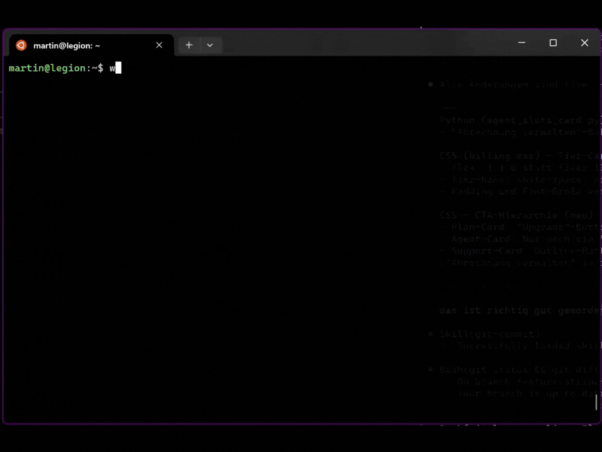

# aib — AI in Bash

AI-powered shell command helper. Describe what you want to do in plain language, pick a command from the interactive menu, and it appears ready-to-run in your terminal.



No copy-paste required — the selected command lands directly in your readline buffer.

---

## Installation

### Prerequisites

- Python 3.10+
- [`uv`](https://docs.astral.sh/uv/) or `pipx`
- [`claude` CLI](https://claude.ai/claude-code) (Claude Max Plan required)

### Install

```bash
# With uv tool (recommended)
uv tool install git+https://github.com/martinblaha/aib.git

# Or with pipx
pipx install git+https://github.com/martinblaha/aib.git
```

### Shell Integration

```bash
# bash
_aib init >> ~/.bashrc && source ~/.bashrc

# zsh
_aib init --shell zsh >> ~/.zshrc && source ~/.zshrc

# fish
_aib init --shell fish >> ~/.config/fish/config.fish
```

---

## Usage

### Keybinding — Alt+A (bash, recommended)

Type your query at the prompt, then press **Alt+A**:

```
$ find all PDFs modified this week[Alt+a]
  → picker appears, select command, it replaces the current line
$ find . -name "*.pdf" -mtime -7    ← ready to edit or run
```

### Direct invocation

```bash
aib "kill process on port 8080"
aib "find and delete node_modules directories"
aib "show disk usage of each subdirectory"
aib "compress a directory to tar.gz"
```

The selected command is shown pre-filled for editing; press Enter to run.

### Zsh

`print -z` injects directly into the ZSH line editor — both `aib "query"` and keybinding work identically.

### Raw output (no shell integration)

```bash
_aib "your query"
```

---

## How It Works

```
aib "query"  ──▶  _aib subprocess  ──▶  claude -p  ──▶  parse response
                       │
                  questionary picker (on /dev/tty)
                       │
                  selected command ──▶ stdout
                       │
             bash: read -e -i (editable prompt)
             zsh:  print -z   (readline buffer injection)
```

**Why two mechanisms for bash?**
`READLINE_LINE` (true readline injection) only works when a function is invoked via `bind -x` — not on direct calls. The `__aib_widget__` keybinding uses `bind -x` for true injection; `aib "query"` falls back to `read -e -i` which shows the command editable before running.

No API key required — uses your existing `claude` CLI session.

---

## Backends

| Backend | Status | Notes |
|---|---|---|
| Claude (`claude -p`) | Available | Requires Claude Code CLI + Max Plan |
| Codex | Planned | |
| Gemini CLI | Planned | |

---

## Configuration

Config file: `~/.config/aib/config.toml`

```toml
backend = "claude"
language = "en"
max_results = 5
timeout = 30
```

---

## Contributing

Issues and PRs welcome. See [docs/REQUIREMENTS.md](docs/REQUIREMENTS.md) for the spec.
